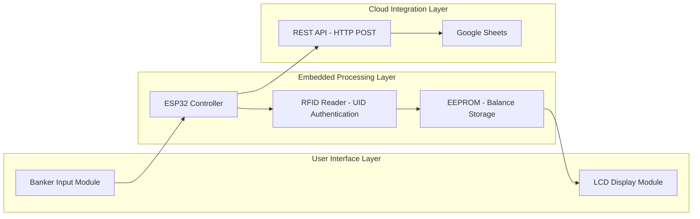

# NOVA – System Architecture

```mermaid
flowchart LR

    subgraph UI_Layer [User Interface Layer]
        A[Banker Input Module]
        B[LCD Display Module]
    end

    subgraph Processing_Layer [Embedded Processing Layer]
        C[ESP32 Controller]
        D[RFID Reader - UID Authentication]
        E[EEPROM - Balance Storage]
    end

    subgraph Cloud_Layer [Cloud Integration Layer]
        F[Google Sheets]
        G[REST API - HTTP POST]
    end

    A --> C
    C --> D
    D --> E
    E --> B
    C --> G
    G --> F
```
